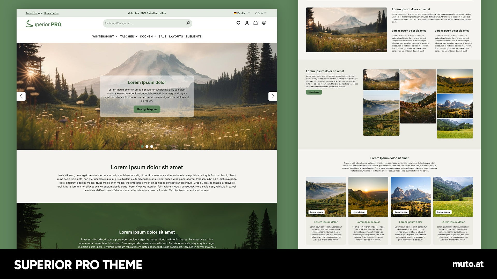

# Dokumentation

<figure><figcaption></figcaption></figure>

Diese Anleitung erklärt, was du im Theme einstellen kannst und wie du die eigenen Bausteine in den Erlebniswelten verwendest. Du brauchst dafür keine Programmierkenntnisse.

Die Einstellungen erreichst du in der Administration unter **Inhalte → Themes**. Wähle dort **Superior PRO Theme** und öffne die Theme-Konfiguration.

Die Kapitel folgen den Tabs im Theme-Manager und den Bausteinen in den Erlebniswelten. Fehlt dir etwas, erreichst du uns über [muto.at](https://muto.at).

[Theme erwerben](https://store.shopware.com/muto435137201325/superior-pro-theme-fuer-shopware-6.html?number=muto435137201325m) · [Demoshop besuchen](http://sw6-superior-pro.muto.one)

## So liest du die Anleitung

* [Einstieg](einstieg/) erklärt, was shopweit gilt und was nur auf einer Seite, und wie du das Theme einem Verkaufskanal zuweist.
* [Theme einrichten](theme-einstellungen/) geht Tab für Tab durch Farben, Schriften, Header, Navigation, Footer, Produktlisten und die übrigen Bereiche.
* [Erlebniswelten](erlebniswelten/) erklärt Sektionen, Blöcke und die eigenen Elemente für Startseite, Kategorien und Landingpages.
* [Hilfen](hilfen/) sammelt Textbausteine, eigene Schriften und den Config-Finder.


Über dem Farb-Preset im Theme-Manager steht eine kurze Bitte um eine Bewertung. Sie ändert keine Farben und keine gespeicherten Werte.

